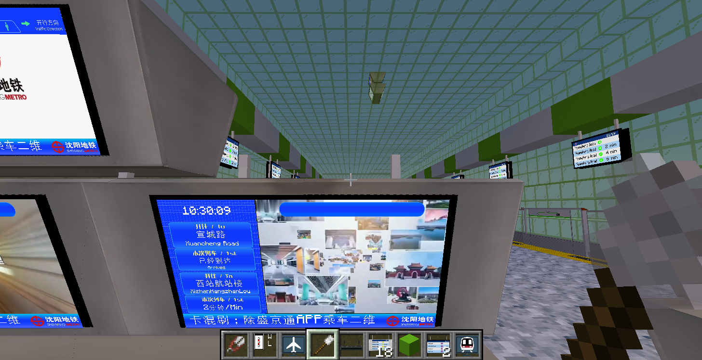

<p align="center">
  
</p>

<h1 align="center">
  沈阳地铁资源包 - PIDS
</h1>

<p align="center">
  <a href="https://modrinth.com/resourcepack/sym-pids-pack">
    
  </a>
</p>

中文 / [English](README_en.md)

# 介绍

本项目是沈阳地铁资源包项目的附属项目，负责使用MTR4，JCM模组复刻沈阳地铁系统内的所有PIDS。

# 截图





# 使用

本项目依赖 `Minecraft Transit Railway 4.0+`, `Joban Client Mod 2.0+` 模组。

更多信息敬请参阅[文档](docs/README.md)

# 开发

本项目为纯js项目，无须搭建脚手架。

本项目中除专有图片外所有图片均使用svg导出，svg文件包含在PIDS_image文件夹中，你可以使用`Inkscape`打开或编辑，你可能需要安装`方正粗倩简体`方能正确显示部分文字样式

`方正粗倩简体`字体文件已经包含在`PIDS_image/FZCQJW.ttf`中，字体不可商用。

本项目提供了一个`Makefile`文件用于测试和打包资源包。

如果你不知道什么是`make`，`Makefile`，直接忽略即可。

请在使用该`Makefile`之前修改文件中`TARGET_DIR=/demo/.minecraft/resourcepack`中文件路径的部分到你的Minecraft资源包文件夹。

可以使用的命令如下
```shell
# 复制本项目内所有内容到Minecraft资源包文件夹内
make

# 将项目内资源包文件打包到SYM_PIDS-Pack.zip中
make release

# 清理打包文件，清理Minecraft资源包文件夹
make clean
```

## LICENSE

本项目除沈阳地铁logo文件（`assets/jsblock/custom_directory/sym_logo.png`），方正粗倩简体字体文件（`PIDS_image/FZCQJW.ttf`），沈阳地铁相关视频素材（`assets/jsblock/custom_directory/sym_pids/sym_video`中的文件）外应遵循`知识共享 署名-非商业性使用-相同方式共享 4.0 国际`协议，上述文件版权归属请联系相应版权方

[LICENSE文件](LICENSE)
