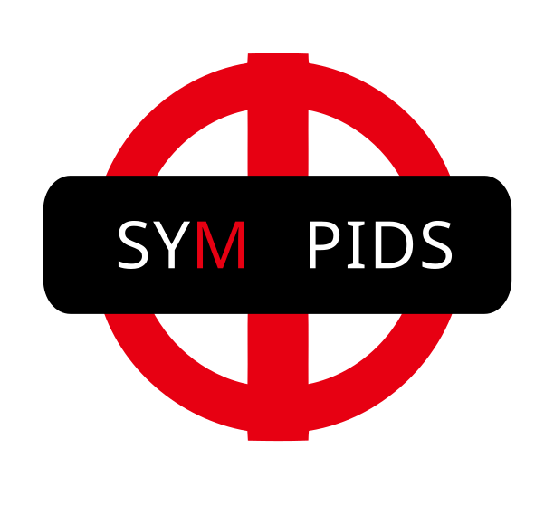
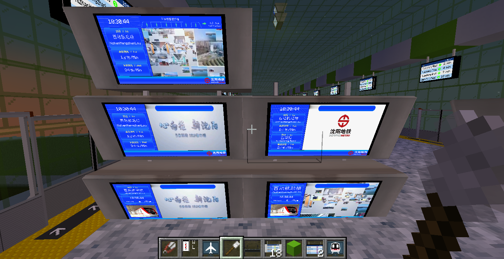

<p align="center">
  
</p>

<h1 align="center">
  SYM (Shenyang Metro) Resource Pack - PIDS
</h1>

<p align="center">
  <a href="https://modrinth.com/resourcepack/sym-pids-pack">
    
  </a>
</p>

[中文](README.md) / English

# Introduction

This project is a subsidiary project of the Shenyang Metro Resource Pack project, responsible for recreating all PIDS within the Shenyang Metro system using MTR4 and JCM modules.

# Screenshots





# Usage

To use this pack, `Minecraft Transit Railway 4.0+`, `Joban Client Mod 2.0+` mod is needed.

For more information please refer to the [documentation](docs/README.md)

# Development

This project is a pure JavaScript project and does not require setting up a scaffold.

Except for proprietary images, all images in this project are exported as SVG and are included in the `PIDS_image` folder. You can use `Inkscape` to open or edit them. You may need to install the `FZCQJW` font to correctly display certain text styles.

The `FZCQJW` font file is already included in `PIDS_image/FZCQJW.ttf`, note that the font is not for commercial use.

The project provides a `Makefile` for testing and packaging the resource pack. 

If you don't know what `make` or `Makefile` is, just ignore it.

Before using the `Makefile`, please modify the file path part of `TARGET_DIR=/demo/.minecraft/resourcepack` to your Minecraft resource pack folder.

The available commands are as follows:
```shell
# Copy all contents of this project to the Minecraft resource pack folder
make

# Package the resource pack files into SYM_PIDS-Pack.zip
make release

# Clean up the packaged files and the Minecraft resource pack folder
make clean
```

## LICENSE

This project, except for the Shenyang Metro logo file (`assets/jsblock/custom_directory/sym_logo.png`), the FZCQJW.ttf font file (`PIDS_image/FZCQJW.ttf`), and the Shenyang Metro video (files in `assets/jsblock/custom_directory/sym_pids/sym_video`), should comply with the `CC BY-NC-SA 4.0 International` license. For the copyright of the aforementioned files, please contact the respective copyright holders.

[LICENSE file](LICENSE)
