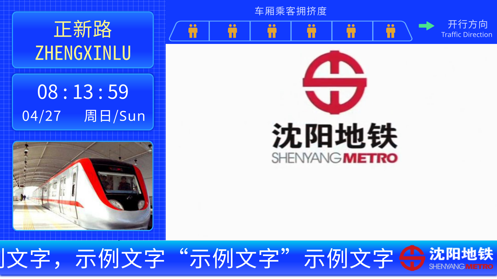

# Configuring PIDS with Custom Information

## Introduction

You can use the MTR brush to modify four custom information fields in the PIDS configuration panel. PIDS will read this information at runtime and apply the configuration.

## Understanding Various Elements in PIDS

Below is an example of the platform-level PIDS:

Before Shenyang Metro Line 4, the platform-level PIDS looked like this:


After Shenyang Metro Line 4, the top bar welcome message on the platform level was changed to the carriage congestion level, as shown below:


From this, we can extract some common elements that exist in all PIDS, as shown in the figure below:


Among them:

- Position 1 is the metro logo, displayed in the bottom bar. If the sidebar is on the left, the logo is on the right, and vice versa.
- Position 2 is the welcome message, displayed in the top bar. If the text is too long, it scrolls.
- Position 3 is the announcement, displayed in the bottom bar. If the text is too long, it scrolls.
- Position 4 is the video, located in the middle of the PIDS.

After Line 4, the welcome message in position 2 of the top bar on the platform level was changed to the carriage congestion level, as shown below:


Based on this, the project has established the following custom information format.

## Custom Information Format

Below is an example of custom information:

```
Info1: jsblock:custom_directory/sym_logo.png
Info2: Welcome to Shenyang Metro Line 4
Info3: Passengers must use the same payment method for entry and exit during the same trip when taking the Shenyang Metro. Mixing payment methods will result in duplicate charges.
Info4: 132|10|jsblock:custom_directory/sym_pids/sym_video/sym_video_{}.png
```

In PIDS that display carriage congestion levels instead of welcome messages, the custom information is as follows:

```
Info1: jsblock:custom_directory/sym_logo.png
Info2: 1|1|1|1|1|1
Info3: Passengers must use the same payment method for entry and exit during the same trip when taking the Shenyang Metro. Mixing payment methods will result in duplicate charges.
Info4: 132|10|jsblock:custom_directory/sym_pids/sym_video/sym_video_{}.png
```

___Note: A valid configuration does not need to fill all four custom information fields; you only need to fill in the fields you want to modify.___

The configuration file is divided into four parts: Logo, Welcome Message and Congestion, Announcement, and Video. Each will be explained below.

### Logo Configuration

Custom Information 1 is for logo configuration.

In this project, the logo is an image displayed in the bottom bar and stored in the resource pack.

The configuration format is as follows:

`path`

The configuration has one parameter: the `path` field, which specifies the path to the logo image.

### Welcome Message and Congestion Configuration

Custom Information 2 is for welcome message and congestion configuration.

In this project, the top bar in PIDS displays either the welcome message or the congestion level, but not both simultaneously. Therefore, the same custom configuration field is used for both.

#### Welcome Message Configuration

In this project, the welcome message is scrolling text displayed in the top bar.

The configuration format is as follows:

`welcome`

The configuration has one parameter: the `welcome` field, which specifies the content of the welcome message.

#### Congestion Configuration

In this project, congestion is represented by six numbers ranging from `0-2`, representing the congestion levels of six carriages. `0` means fewer passengers, `1` means more passengers, and `2` means the most passengers.

The configuration format is as follows:

`number1|number2|number3|number4|number5|number6`

The configuration is an array separated by `|`. It must contain six numbers (extra numbers will be ignored). If there are fewer than six numbers, the configuration is invalid.

### Announcement Configuration

Custom Information 3 is for announcement configuration.

In this project, the announcement is scrolling text displayed in the bottom bar.

The configuration format is as follows:

`announcement`

The configuration has one parameter: the `announcement` field, which specifies the content of the announcement.

### Video Configuration

Custom Information 4 is for video configuration.

In this project, the video is a series of image frames stored in the resource pack.

The configuration format is as follows:

`size|rate|path`

or

`size|path`

The configuration has three parameters separated by `|`. The `path` field specifies the template for the video frame image path. The template contains a placeholder `{}`, which PIDS will automatically replace with the current frame number (starting from 1) at runtime.

The `size` field specifies the total number of frames in the video, i.e., the number of video images.

The `rate` field specifies the frame rate of the video, i.e., the number of frames played per second. This field is optional. If the custom information contains only two fields separated by `|`, the frame rate defaults to 10 fps.

This project includes a built-in video, but you can also add custom videos in your new resource pack.

## More

You can refer to [Configuring PIDS via Files](file.md) for methods to configure PIDS in the configuration file.
