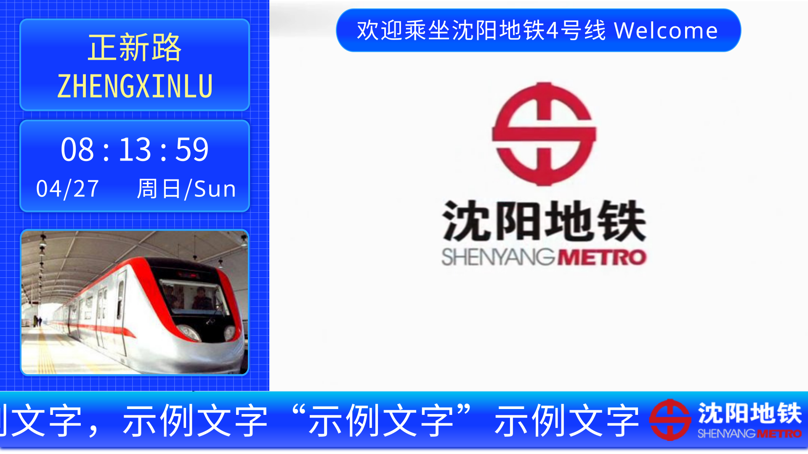
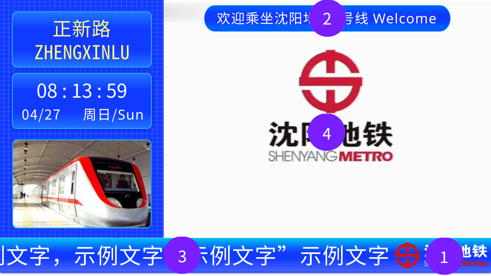

# Configuring PIDS via Files

## Introduction

You can create an additional resource pack with a `jsblock:sym_pids_global_config.json` file. PIDS will read this file at runtime and apply the configuration.

For example, if you create a resource pack with the following file structure:

```
- assets
| - jsblock
|   - sym_pids_global_config.json
- pack.png
- pack.mcmeta
```

and import it into Minecraft and enable it, PIDS will read the file at runtime and apply the configuration.

## Understanding Various Elements in PIDS

Below is an example of the platform-level PIDS:

Before Shenyang Metro Line 4, the platform-level PIDS looked like this:


After Shenyang Metro Line 4, the top bar welcome message on the platform level was changed to the carriage congestion level, as shown below:


From this, we can extract some common elements that exist in all PIDS, as shown in the figure below:


Among them:

- Position 1 is the metro logo, displayed in the bottom bar. If the sidebar is on the left, the logo is on the right, and vice versa.
- Position 2 is the welcome message, displayed in the top bar. If the text is too long, it scrolls.
- Position 3 is the announcement, displayed in the bottom bar. If the text is too long, it scrolls.
- Position 4 is the video, located in the middle of the PIDS.

After Line 4, the welcome message in position 2 of the top bar on the platform level was changed to the carriage congestion level, as shown below:


Based on this, the project has established the following configuration file format.

## Configuration File Format

Below is a sample configuration file:

```json
{
  "video": {
    "path": "jsblock:custom_directory/sym_pids/sym_video/sym_video_{}.png",
    "size": 132,
    "rate": 10
  },
  "logo": {
    "path": "jsblock:custom_directory/sym_logo.png"
  },
  "text": {
    "welcome": "Welcome to Shenyang Metro Line 4",
    "announcement": "When taking the Shenyang Metro, passengers must use the same payment method for entry and exit during the same trip. Mixing payment methods will result in duplicate charges. Mixing includes: using QR codes generated by different apps; mixing QR codes or facial recognition with single tickets, Shengjing Tong cards, UnionPay cards, etc.; except for QR codes and facial recognition from the Shengjing Tong app, which can be mixed under the same registered phone number when both features are enabled. Other QR codes and facial recognition cannot be mixed."
  },
  "congestion": [0, 0, 0, 0, 0, 0]
}
```

___Note: A valid configuration file does not need to include all content; it only needs to include the content you want to modify.___

The configuration file is divided into four parts: video, logo, text, and congestion. Each will be explained below.

### Video Configuration

The `video` section in the configuration is for video settings.

In this project, videos are a series of image frames stored in the resource pack.

There are three parameters in the configuration. The `path` parameter is the template for the video frame image path. The template contains a placeholder `{}`, which PIDS will automatically replace with the current frame number (starting from 1) at runtime.

The `size` parameter is the total number of frames in the video, i.e., the number of video images.

The `rate` parameter is the frame rate of the video, i.e., the number of frames played per second.

This project includes a built-in video, but you can also add custom videos in your new resource pack.

### Logo Configuration

The `logo` section in the configuration is for logo settings.

In this project, the logo is an image displayed in the bottom bar and stored in the resource pack.

The configuration has one parameter: the `path` parameter, which is the path to the logo image.

### Text Configuration

The `text` section in the configuration is for text settings.

In this project, the text includes the welcome message and announcements displayed in the top and bottom bars.

There are two parameters in the configuration: the `welcome` parameter for the welcome message content and the `announcement` parameter for the announcement content.

### Congestion Configuration

The `congestion` section in the configuration is for congestion settings.

In this project, congestion is represented by six numbers ranging from `0-2`, representing the congestion levels of six carriages. `0` means fewer passengers, `1` means more passengers, and `2` means the most passengers.

The configuration is an array that must contain six numbers (extra numbers will be ignored). If there are fewer than six numbers, the configuration is invalid.

## More

You can refer to [Configuring PIDS with Custom Information](custom.md) for methods to configure PIDS in the game.
