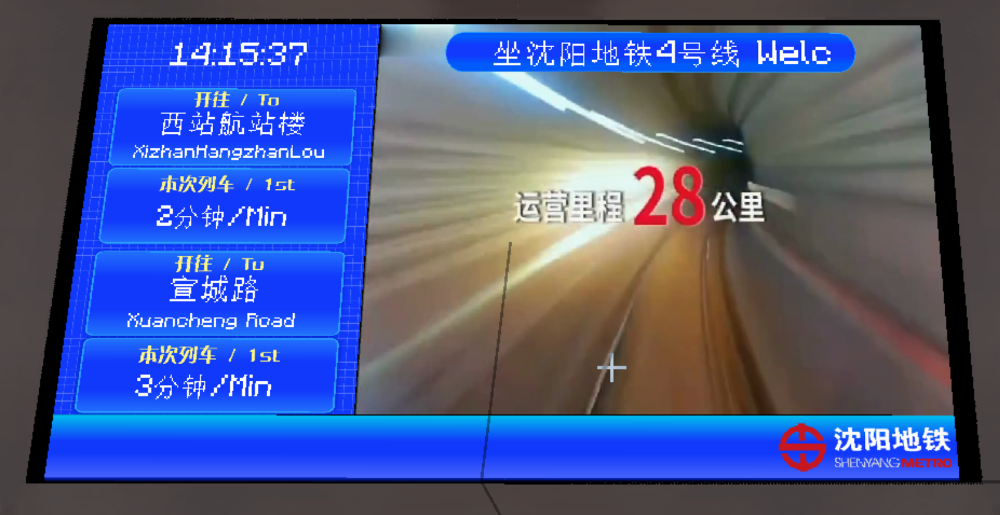
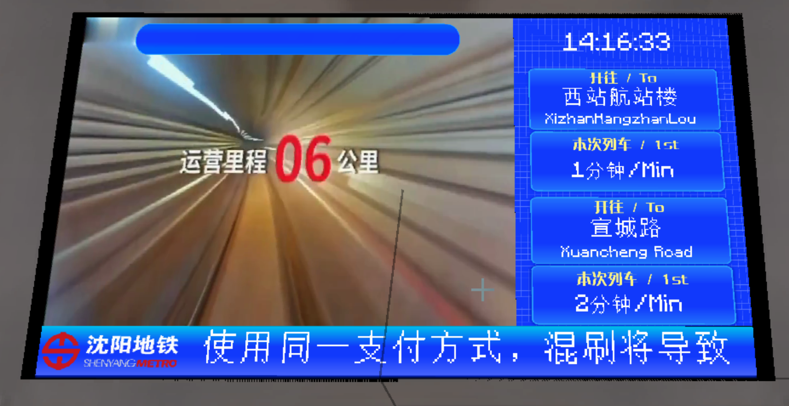

# Concourse Level Bidirectional Current Train Style PIDS

## Screenshots

Sidebar on the left:

Sidebar on the right:

## Introduction

PIDS that display the current train for two platforms.

## Usage

In any PIDS within the Joban Client Mod, select the `sym_pids_concourse_level_left` or `sym_pids_concourse_level_right` style.

___Note: You need to bind two platforms to display train schedules correctly. Binding only one will display only one current train.___

## Configuration

This PIDS supports two configuration methods. Please refer to the configuration documentation for more information.

