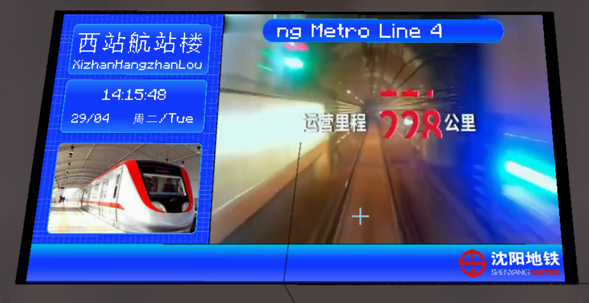
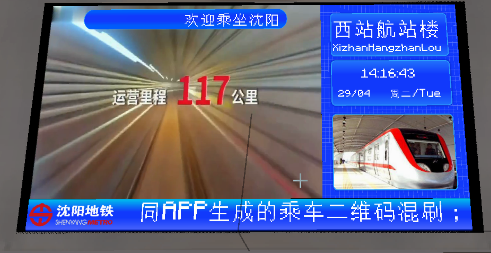

# Concourse Level Destination Style PIDS

## Screenshots

Sidebar on the left:

Sidebar on the right:

## Introduction

PIDS that only display the station name and current time.

## Usage

In any PIDS within the Joban Client Mod, select the `sym_pids_concourse_level_destination_left` or `sym_pids_concourse_level_destination_right` style.

## Configuration

This PIDS supports two configuration methods. Please refer to the configuration documentation for more information.

