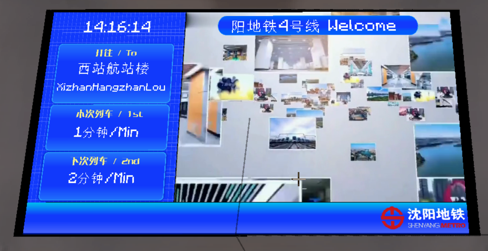

# Platform Level Current and Next Train Style PIDS (Pre-Line 4 Welcome Message Version)

## Screenshots

Sidebar on the left:

Sidebar on the right:

## Introduction

PIDS that display the current and next train for a single platform (top bar shows a welcome message).

## Usage

In any PIDS within the Joban Client Mod, select the `sym_pids_platform_level_before4_left` or `sym_pids_platform_level_before4_right` style.

___Note: You may need to bind a platform to display train schedules correctly.___

## Configuration

This PIDS supports two configuration methods. Please refer to the configuration documentation for more information.

