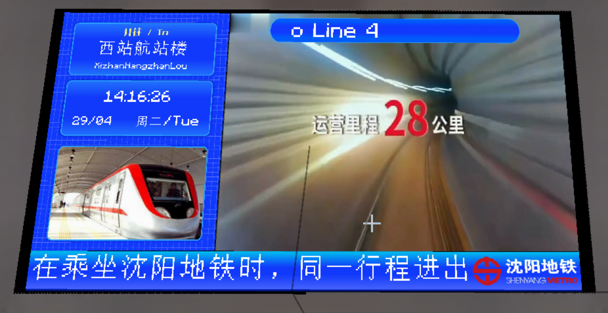
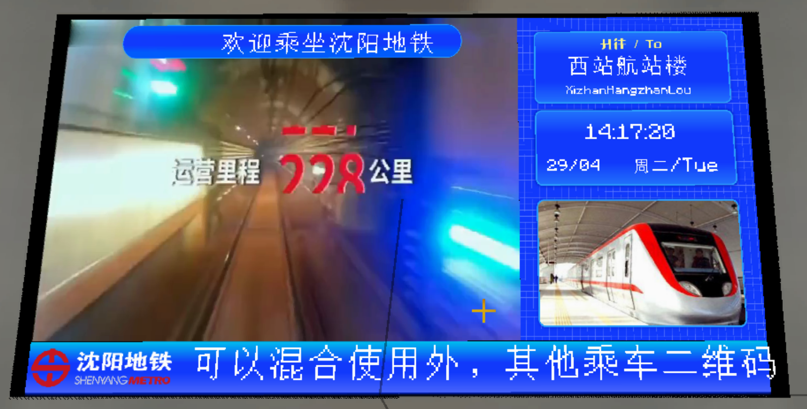

# Platform Level Destination Style PIDS

## Screenshots

Sidebar on the left:

Sidebar on the right:

## Introduction

PIDS that only display the destination of a single platform and the current time.

## Usage

In any PIDS within the Joban Client Mod, select the `sym_pids_platform_level_destination_left` or `sym_pids_platform_level_destination_right` style.

___Note: You may need to bind a platform to display train schedules correctly.___

## Configuration

This PIDS supports two configuration methods. Please refer to the configuration documentation for more information.

