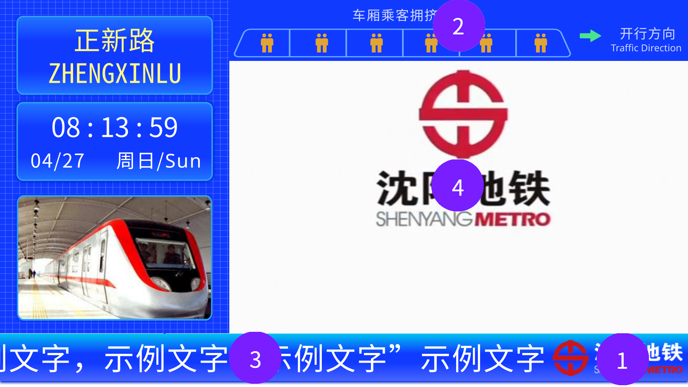

# 通过自定义信息配置PIDS

## 简介

你可以使用MTR刷子在PIDS配置面板中修改四条自定义信息，PIDS在运行时会读取这些信息并应用配置。

## 认识PIDS中的各种内容

以下是站台层PIDS的示例：

沈阳地铁4号线之前，站台层的PIDS如下：


在沈阳地铁4号线之后，站台层顶栏的欢迎语改为车厢乘客拥挤度如下：


我们可以从中抽取出一些共性的元素，这些元素在所有PIDS中均存在，如下图所示：


其中：

- 1号位是地铁Logo，在底栏显示，侧边栏在左则Logo在右，反之亦然
- 2号为为欢迎语，在顶栏显示，字数较多则滚动显示
- 3号位为公告，在底栏显示，字数较多则滚动显示
- 4号位为视频，位于PIDS中间位置

在4号线之后，站台层顶栏2号位的欢迎语则改为车厢乘客拥挤度，如下：


故基于此，本项目制定了如下的自定义信息格式。

## 自定义信息格式

一个示例的自定义信息如下：

```
信息1: jsblock:custom_directory/sym_logo.png
信息2: 欢迎乘坐沈阳地铁4号线 Welcome to Shenyang Metro Line 4
信息3: 乘客在乘坐沈阳地铁时，同一行程进出站时需使用同一支付方式，混刷将导致重复扣费
信息4: 132|10|jsblock:custom_directory/sym_pids/sym_video/sym_video_{}.png
```

在包含乘客拥挤度为而不是欢迎语的PIDS中，自定义信息如下：

```
信息1: jsblock:custom_directory/sym_logo.png
信息2: 1|1|1|1|1|1
信息3: 乘客在乘坐沈阳地铁时，同一行程进出站时需使用同一支付方式，混刷将导致重复扣费
信息4: 132|10|jsblock:custom_directory/sym_pids/sym_video/sym_video_{}.png
```

___需要注意的是：一个合法的配置不需要填满全部的四个自定义消息，只需要填充你想修改的项即可。___

配置文件分为四个部分：Logo，欢迎语和拥挤度，公告，视频，下面将逐个说明。

### Logo配置

自定义信息1为Logo配置。

在本项目中，Logo为显示在底栏的图片，储存在资源包中。

配置项的格式如下：

`path`

配置项有一个参数，`path`项为Logo图片的路径。

### 欢迎语和拥挤度配置

自定义信息2为欢迎语和拥挤度配置。

因为在本项目PIDS中，顶栏要么是欢迎语要么是拥挤度，二者不可能同时存在，所以使用同一个自定义配置项进行配置。

#### 欢迎语配置

在本项目中，欢迎语为展示在顶栏滚动文字。

配置项格式如下：

`welcome`

配置项有一个参数，`welcome`项为欢迎语的内容。

#### 拥挤度配置

在本项目中，拥挤度为六个范围为`0-2`的数字，代表六节车厢的拥挤度，`0`为人数较少，`1`为人数较多，`2`为人数最多

配置项格式如下：

`number1|number2|number3|number4|number5|number6`

配置项为一个使用`|`分隔的数组，需要填满六个数字（可以超出六个，多余的不生效），否则无效。

#### 公告配置

自定义信息3为公告配置。

在本项目中，公告为显示在底栏的滚动文字。

配置项格式如下：

`announcement`

配置项有一个参数，`announcement`项为公告的内容

### 视频配置

自定义信息4为视频配置

在本项目中，视频为一系列的图片帧，储存在资源包中。

配置项格式如下：

`size|rate|path`

或

`size|path`

配置项有三个参数，以`|`分隔，其中`path`项为视频帧的图片路径模板，在模板中存在一个占位符`{}`，PIDS在运行时会将其自动替换为视频当前帧（从1开始）

`size`项为视频的总帧数，即视频图片的数量

`rate`项为视频的帧率，即一秒播放的帧数，可以不配置，即自定义信息中只有使用`|`分隔的两项内容，此时帧率为10fps。

本项目中自带了一个视频，你也可以在你新建的资源包中添加自定义的视频。

## 更多

你可以参阅[通过文件配置PIDS](custom.md)获取在配置文件中配置PIDS的方法。
