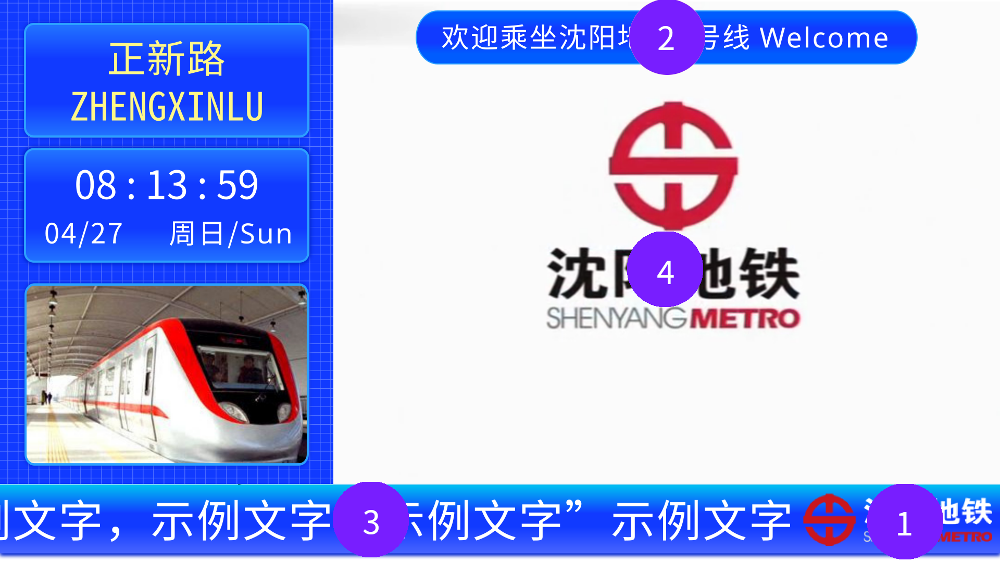
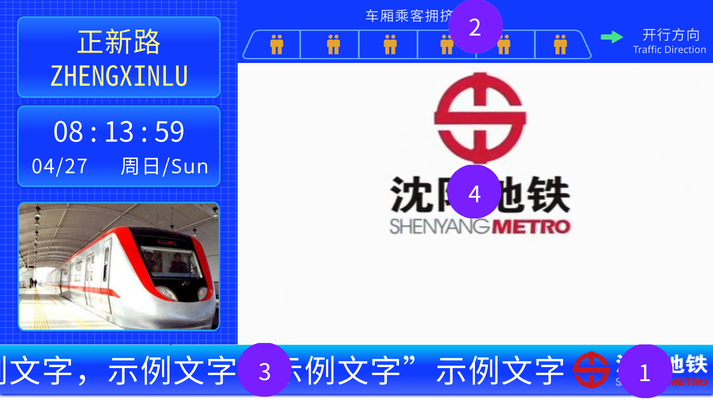

# 通过文件配置PIDS

## 简介

你可以创建一个带有`jsblock:sym_pids_global_config.json`文件的附加资源包，PIDS在运行时会读取这个文件并应用配置。

例如，你新建一个资源包，资源包的文件结构如下：

```
- assets
| - jsblock
|   - sym_pids_global_config.json
- pack.png
- pack.mcmeta
```

并将其导入Minecraft中并启用，PIDS在运行时即可读取该文件并应用其中的配置。

## 认识PIDS中的各种内容

以下是站台层PIDS的示例：

沈阳地铁4号线之前，站台层的PIDS如下：


在沈阳地铁4号线之后，站台层顶栏的欢迎语改为车厢乘客拥挤度如下：


我们可以从中抽取出一些共性的元素，这些元素在所有PIDS中均存在，如下图所示：


其中：

- 1号位是地铁Logo，在底栏显示，侧边栏在左则Logo在右，反之亦然
- 2号为为欢迎语，在顶栏显示，字数较多则滚动显示
- 3号位为公告，在底栏显示，字数较多则滚动显示
- 4号位为视频，位于PIDS中间位置

在4号线之后，站台层顶栏2号位的欢迎语则改为车厢乘客拥挤度，如下：


故基于此，本项目制定了如下的配置文件格式。

## 配置文件格式

如下是一个示例配置文件：

```json
{
  "video": {
    "path": "jsblock:custom_directory/sym_pids/sym_video/sym_video_{}.png",
    "size": 132,
    "rate": 10
  },
  "logo": {
    "path": "jsblock:custom_directory/sym_logo.png"
  },
  "text": {
    "welcome": "欢迎乘坐沈阳地铁4号线 Welcome to Shenyang Metro Line 4",
    "announcement": "乘客在乘坐沈阳地铁时，同一行程进出站时需使用同一支付方式，混刷将导致重复扣费，混刷包括：不同APP生成的乘车二维码混刷；乘车二维码或人脸与单程票、盛京通卡、银联卡闪付等实体卡混刷；除盛京通APP乘车二维码与人脸，在乘客开通乘车二维码和刷脸乘车功能时，使用同一注册手机号情况下可以混合使用外，其他乘车二维码与人脸混刷等。"
  },
  "congestion": [0, 0, 0, 0, 0, 0]
}
```

___需要注意的是：一个合法的配置文件不需要包含全部的内容，只需要包含你想修改的内容即可。___

配置文件分为四个部分：视频，Logo，文字，拥挤度，下面将逐个说明。

### 视频配置

配置中`video`项为视频配置

在本项目中，视频为一系列的图片帧，储存在资源包中。

配置项有三个参数，其中`path`项为视频帧的图片路径模板，在模板中存在一个占位符`{}`，PIDS在运行时会将其自动替换为视频当前帧（从1开始）

`size`项为视频的总帧数，即视频图片的数量

`rate`项为视频的帧率，即一秒播放的帧数

本项目中自带了一个视频，你也可以在你新建的资源包中添加自定义的视频。

### Logo配置

配置中`logo`项为Logo配置

在本项目中，Logo为显示在底栏的图片，储存在资源包中。

配置项有一个参数，`path`项为Logo图片的路径。

### 文字配置

配置中`text`为文字配置

在本项目中，文字为显示在顶栏和底栏的欢迎语和公告。

配置项有两个参数，`welcome`项为欢迎语的内容，`announcement`项为公告的内容

### 拥挤度配置

配置中`congestion`为拥挤度配置

在本项目中，拥挤度为六个范围为`0-2`的数字，代表六节车厢的拥挤度，`0`为人数较少，`1`为人数较多，`2`为人数最多

配置项为一个数组，需要填满六个数字（可以超出六个，多余的不生效），否则无效。

## 更多

你可以参阅[通过自定义信息配置PIDS](custom.md)获取在游戏中配置PIDS的方法。
