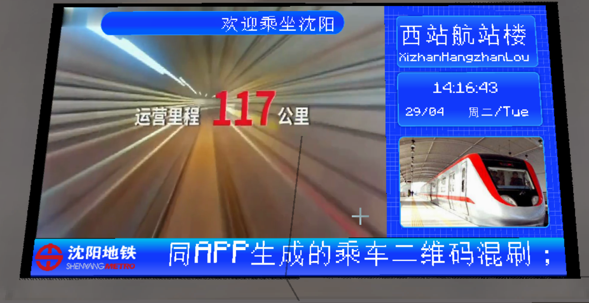

# 站厅层终点站样式PIDS

## 截图

侧边栏在左侧：

侧边栏在右侧：

## 介绍

只显示本站站名和当前时间的PIDS

## 使用方式

在Joban Client Mod中任意一个PIDS中选择`sym_pids_concourse_level_destination_left`或`sym_pids_concourse_level_destination_right`样式即可。

## 配置

本PIDS支持两种配置方式，请前往配置文档获取更多信息
