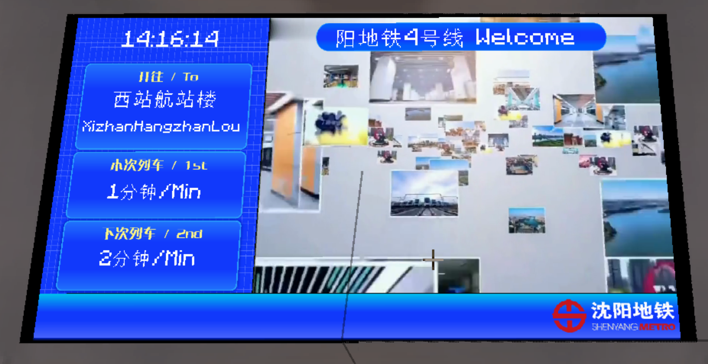
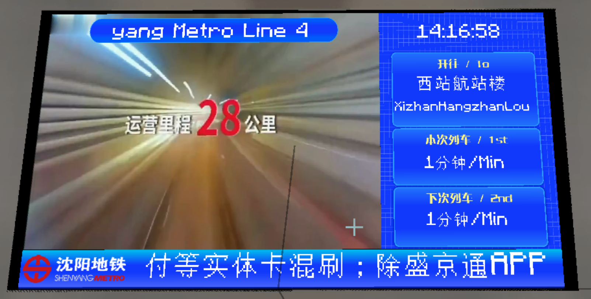

# 站台层本次列车下次列车样式PIDS（4号线之前欢迎语版本）

## 截图

侧边栏在左侧：

侧边栏在右侧：

## 介绍

显示单个站台本次列车和下次列车的PIDS（顶栏为欢迎语）

## 使用方式

在Joban Client Mod中任意一个PIDS中选择`sym_pids_platform_level_before4_left`或`sym_pids_platform_level_before4_right`样式即可。

___注意，你可能需要绑定一个站台以正确显示列车时刻___

## 配置

本PIDS支持两种配置方式，请前往配置文档获取更多信息
