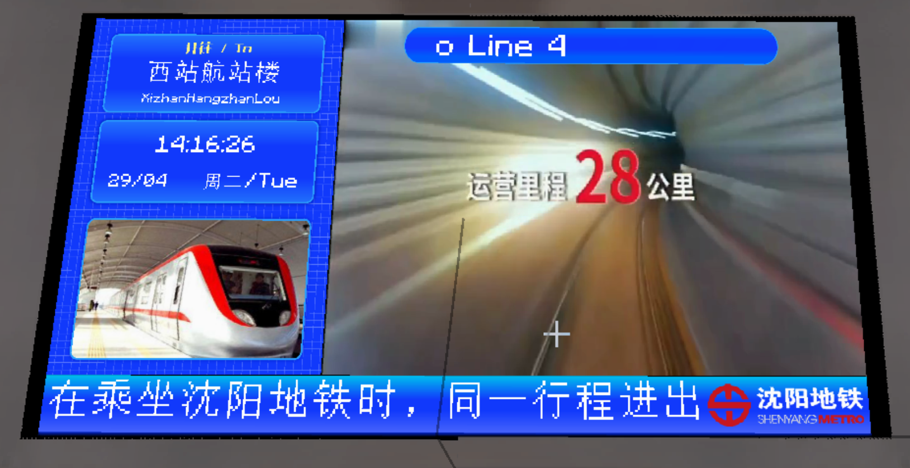

# 站台层终点站样式PIDS

## 截图

侧边栏在左侧：

侧边栏在右侧：

## 介绍

只显示单个站台终点站和当前时间的PIDS

## 使用方式

在Joban Client Mod中任意一个PIDS中选择`sym_pids_platform_level_destination_left`或`sym_pids_platform_level_destination_right`样式即可。

___注意，你可能需要绑定一个站台以正确显示列车时刻___

## 配置

本PIDS支持两种配置方式，请前往配置文档获取更多信息
